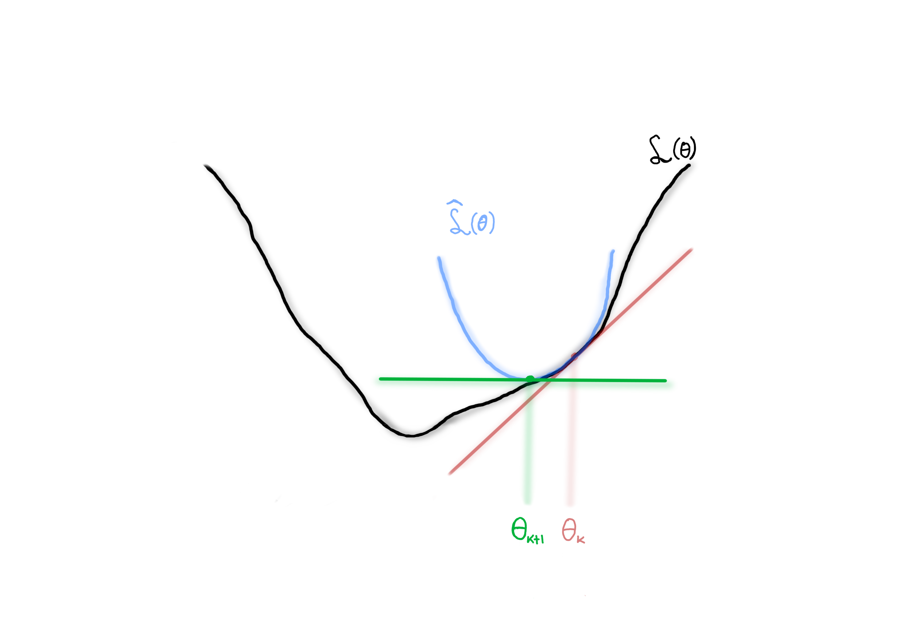

<h3 style="text-align: center">Continuous problem</h3>

<!-- ======== SMALL ======== -->
- <small> Blabla </small>

Blabla.

<!-- ======== Layouts ======== -->
layout: two-cols

<!-- ======== Images ======== -->

<!-- ======== CENTER ======== -->

 Center text

 Center text

 Center text
<h3 style="text-align: center"> Center text</h3>

<!-- ======== WHITE ======== -->
### [Ghost]{style="color: white;"}
<h3 style="color: white; text-align: center">Ghost</h3>
$$\color{white}$$

<!-- ======== GRID ======== -->

...

<!-- ======== MOTION/IMAGE ======== -->

<!-- ======== CLICK ======== -->
<v-click>
....
</v-click>

<!-- ======== Table of contents ======== -->
<Toc text-sm minDepth="1" maxDepth="2" />