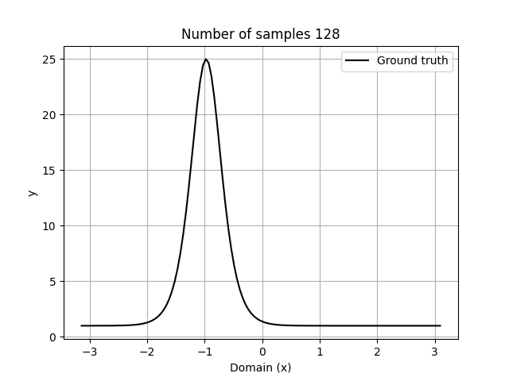
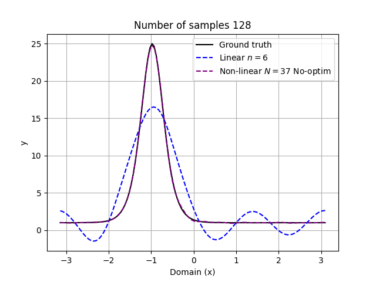
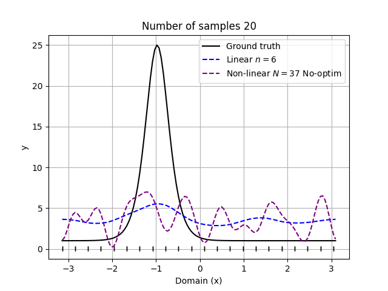
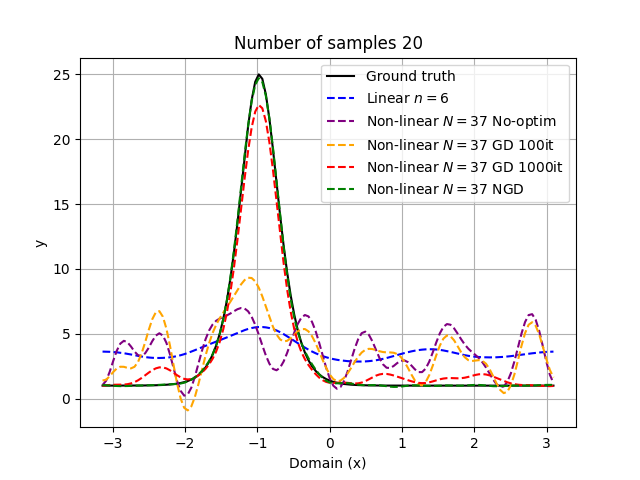

# *Online learning* in Reduced Order Modelling
Natural Gradient for *online learning* in non-linear Reduced Order Modelling.

_____

 
#### Korteweg-de Vries (KdV) equation  

$$\frac{\partial \u}{\partial t}+4\u\frac{\partial \u}{\partial x}+\frac{\partial^3 \u}{\partial x^3}$$

_____

$${\colorM v_{\text{lin}}}(x) = \sum_{i=1}^n \theta_i{\colorV \phi_i}(x)$$
$${\colorM v_{\text{non-lin}}}(x) = \sum_{i=1}^n \theta_i{\colorV \phi_i}(x) + \sum_{j=n+1}^N \mathcal{NN}(\theta)_j{\colorV \phi_j}(x)$$

::right::

<v-click>

</v-click>

<v-click>

</v-click>

<v-click>

</v-click>

<v-click>

</v-click>

<v-click>

</v-click>
