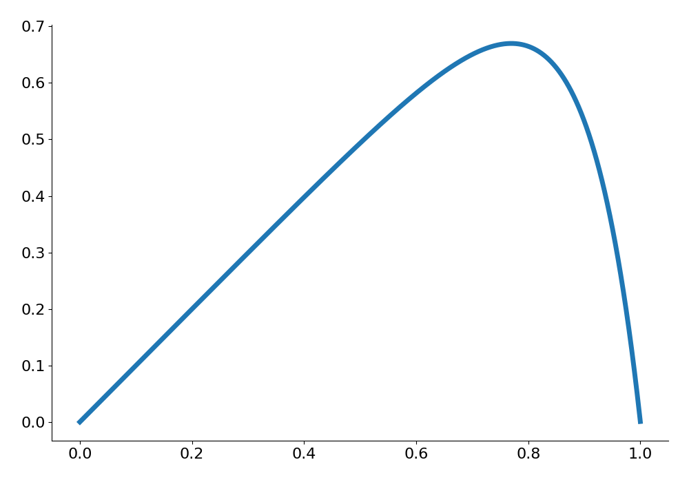
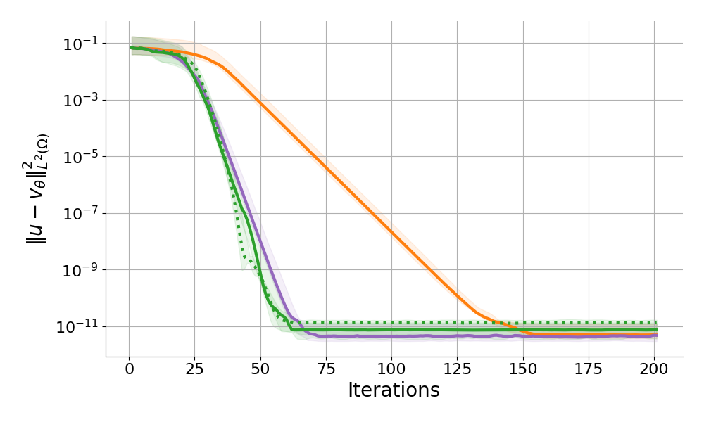
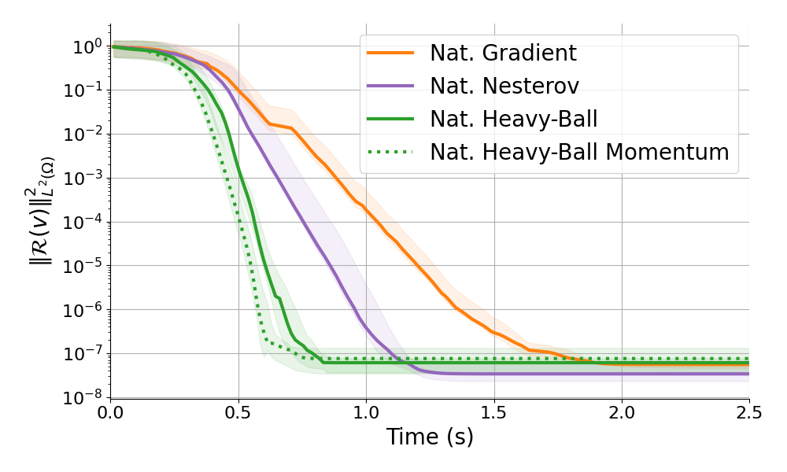

# Physics informed learning.
Reaction diffusion (PINNs) $\text{}\\$
$[$Müller J., Zeinhofer M. (2023)$]$ $\text{}\\$
$[$Schwencke N., Furtlehner C. (2024)$]$. 

$$\v(x) = x(1-x)\,\mathcal{NN}_\theta(x) $$

$$
\begin{aligned}
\cL(\v) &= \|-\epsilon \partial_{xx} \v+\partial_x \v-1\|^2_{L^2([0,1])} \\
\cL(\v) &= \|\mathcal{R}(\v)\|^2_{L^2([0,1])} \\
\cL({\colorM v'}) &= \|{\colorM v'}\|^2_{L^2([0,1])}  \\
\end{aligned}
$$

$${\colorM v'} \in \cM' := \{ {\colorM v'}=\mathcal{R}(\v)\}$$

<!-- 
\cL(\vk) &= \frac{1}{2m} \sum_i^m (-\epsilon \partial_{xx} \v(x_{I_i^k})+\partial_x \v(x_{I_i^k})-1)^2
 -->

::right::

  

