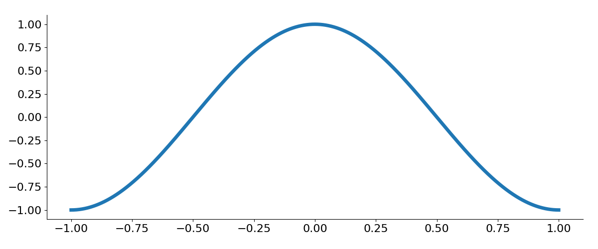
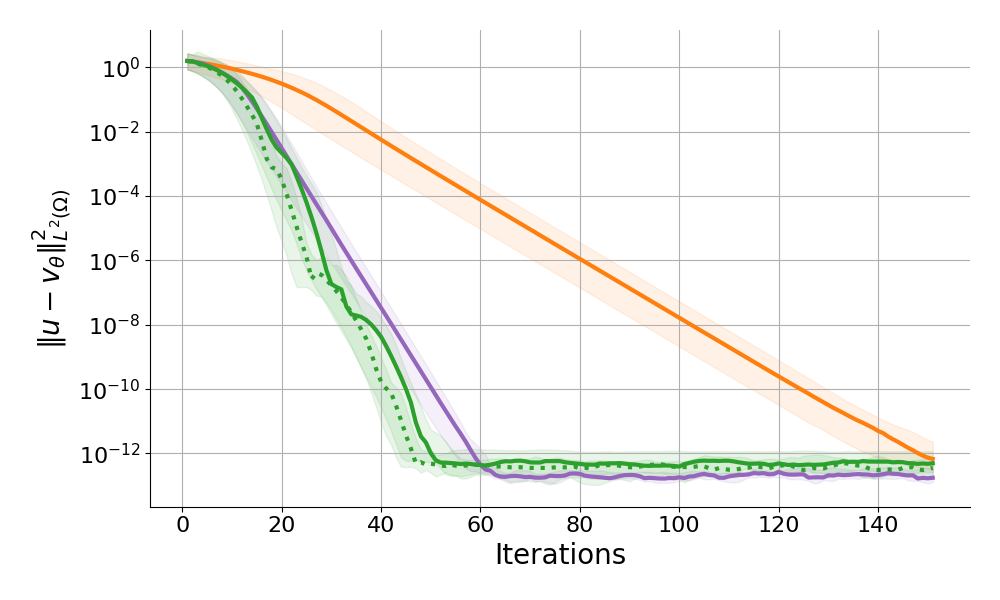
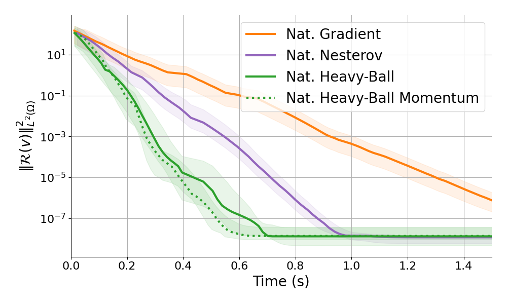

# Physics informed learning.
Non-linear PDE (PINNs) $\text{}\\$
$[$Müller J., Zeinhofer M. (2023)$]$ $\text{}\\$
$[$Schwencke N., Furtlehner C. (2024)$]$. 

$$\v(x) = (1-x)^2(x-1)^2 \,\mathcal{NN}_\theta(x) \\+c+a\left(\frac{x^3}{3}-x\right) $$

$$
\begin{aligned}
\cL(\v) &= \|-\partial_{xx} \v + \v^3 - \pi^2\cos(\pi x)+\cos^3(\pi x)\|^2 \\
\cL(\v) &= \|\mathcal{R}(\v)\|^2_{L^2([-1,1])} \\
\cL({\colorM v'}) &= \|{\colorM v'}\|^2_{L^2([-1,1])}  \\
\end{aligned}
$$

$${\colorM v'} \in \cM' := \{ {\colorM v'}=\mathcal{R}(\v)\}$$

<!-- 
\cL(\vk) &= \frac{1}{2m} \sum_i^m (-\epsilon \partial_{xx} \v(x_{I_i^k})+\partial_x \v(x_{I_i^k})-1)^2
 -->

::right::

  

