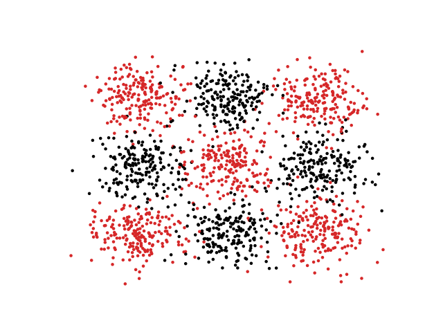
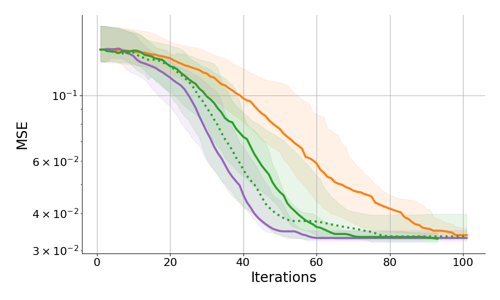
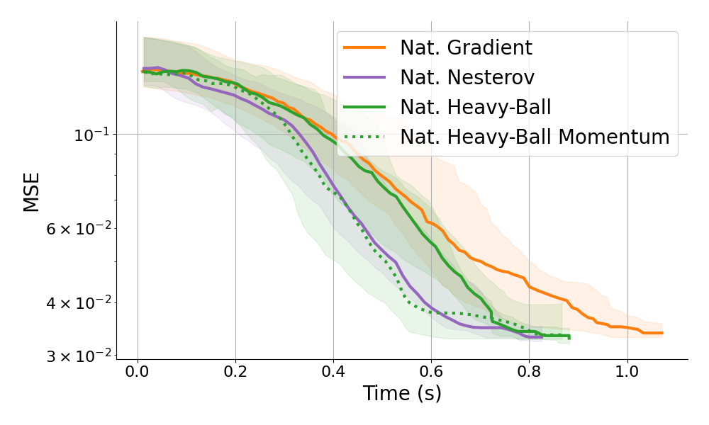

# Classification task
Another less toy example from $[$Park, H, S.-I Amari, and K Fukumizu (2000)$]$.

Mackey Glass caotic time series: 
- Input: $z\in \R^2$
- Output: $c\in \{0, 1\}$

$\cL_\u(\v)=\int-\u \log(\v) - (1 - \u) \log(1 - \v)$

Model (Shallow NN): $\vp: \R^2 \to [0, 1]$ 

::right::

  

